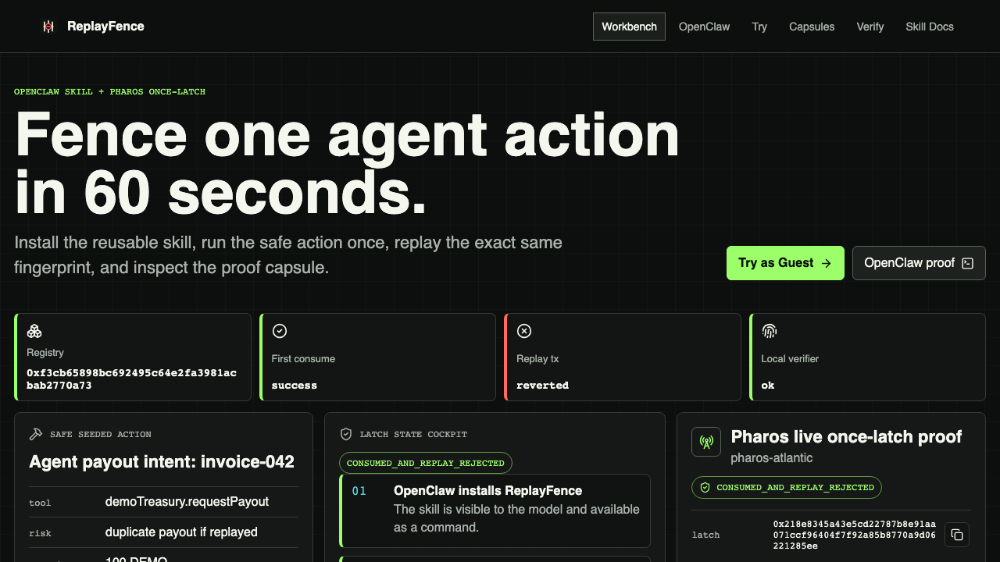
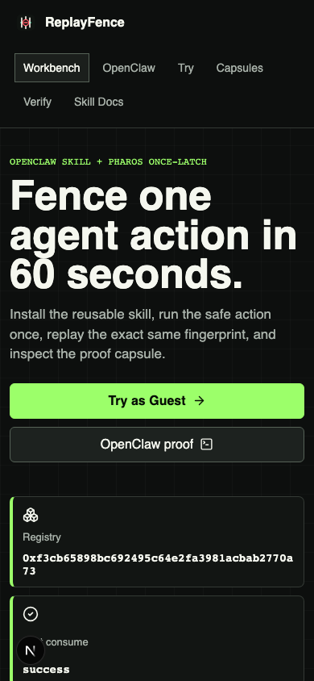
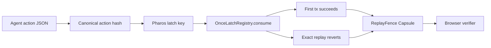

<div align="center">



# ReplayFence

### ReplayFence blocks duplicate agent actions on Pharos in 60 seconds.

*Run one safe agent action, replay the exact same fingerprint, and inspect the Pharos receipt plus proof capsule without trusting a narrator.*

**Quick links:**
[OpenClaw evidence](./demo/openclaw-install.md) ·
[TUI prompt report](./.hunter/openclaw-tui-interactive.report.json) ·
[Narrated skill demo](./pitch/recording/replayfence-skill-demo-english-narrated.mp4) ·
[Agent prompt report](./.hunter/openclaw-agent-prompt.report.json) ·
[Architecture](./docs/ARCHITECTURE.md) ·
[Pharos consume report](./demo/pharos-consume-report.json) ·
[Runtime report](./.hunter/runtime-interaction.report.json)

</div>

---

## Why It Matters

Agent runtimes retry tool calls after timeouts, queue redelivery, double clicks, and model loops. For payments, deploys, orders, or privileged API calls, one duplicate side effect is enough to create real loss.

ReplayFence turns the usual private idempotency log into a reusable Skill primitive: a deterministic action hash, a Pharos once-latch, a rejected replay, and a portable capsule another reviewer can verify.

| Question | Private retry log | ReplayFence |
| --- | --- | --- |
| Can another agent inspect it? | Usually no | Yes, via capsule JSON |
| Is the replay result public? | No | Yes, via Pharos tx/revert evidence |
| Does it install as a reusable skill? | No | Yes, OpenClaw reports ready |

## Demo Path

<table>
  <tr>
    <td width="50%"></td>
    <td width="50%"></td>
  </tr>
  <tr>
    <td><b>1.</b> Open the workbench and start as a guest.</td>
    <td><b>2.</b> Reveal first consume, then replay the same action.</td>
  </tr>
  <tr>
    <td width="50%"></td>
    <td width="50%"></td>
  </tr>
  <tr>
    <td><b>3.</b> Verify the capsule or live Pharos report.</td>
    <td><b>4.</b> The first screen remains usable on mobile.</td>
  </tr>
</table>

## Quick Start

```bash
npm install
cp .env.example .env.local
npm run dev -- --port 4387
```

Open <http://127.0.0.1:4387>, click `Try as Guest`, then click `Fence + Execute Once` and `Replay Same Action`.

Run the evidence checks:

```bash
npm run build
npm test
npm run contract:compile
npx playwright test tests/runtime-interaction.spec.ts
node /Users/rick/Documents/MySkill/hackathonhunter-skill/scripts/audit_project.mjs . --phase claims,runtime,feature-density,realness
```

## Live Pharos Proof

- Registry: `0xf3cb65898bc692495c64e2fa3981acbab2770a73`
- Deploy tx: `0xba7cf7df008b812a8ffefecc7688929531496f1a6bb3030fcb331365be5c399d`
- First consume tx: `0x7dcfe6f8306168d8c36730ea41b37606e54a294cc4931fcf268dd8aecc74941d`
- Reverted replay tx: `0xf428dbdf2915bad77a6cc2fa8b6d6a554c98d77f8e21407fdc462cdcbbdabe6d`

The current public workbench displays recorded live Pharos evidence. To generate a fresh local proof pair with a funded testnet key:

```bash
npm run contract:consume:pharos
```

## OpenClaw Skill Proof

ReplayFence is packaged as an installable OpenClaw skill. The primary judge-facing demo combines a real OpenClaw TUI prompt with the browser user flow. The prompt is typed into `openclaw tui --local`, not loaded from a file or passed with `--message`. The typed request is short and user-like: "Can you use ReplayFence to protect a payout for me?" OpenClaw reads the installed `replayfence` skill, runs the bundled demo through `exec`, verifies the capsule, and answers with the blocked duplicate result. The browser half shows the same guarantee from a user's point of view: execute once, reject the exact replay, inspect the saved capsule, and verify it later.

Primary TUI evidence:

- English narrated skill demo: [`pitch/recording/replayfence-skill-demo-english-narrated.mp4`](./pitch/recording/replayfence-skill-demo-english-narrated.mp4)
- Browser user-case clip: [`pitch/recording/replayfence-user-cases-demo.mp4`](./pitch/recording/replayfence-user-cases-demo.mp4)
- Raw TUI typescript: [`demo/openclaw-tui-interactive.typescript`](./demo/openclaw-tui-interactive.typescript)
- Session tool calls: [`demo/openclaw-tui-interactive-session-events.json`](./demo/openclaw-tui-interactive-session-events.json)
- Report: [`.hunter/openclaw-tui-interactive.report.json`](./.hunter/openclaw-tui-interactive.report.json)
- Raw silent video: [`pitch/recording/openclaw-tui-interactive-demo.mp4`](./pitch/recording/openclaw-tui-interactive-demo.mp4)
- Agent-created capsule: [`demo/openclaw-tui-replayfence-capsule.json`](./demo/openclaw-tui-replayfence-capsule.json)

The recorded command shape is:

```bash
npx --yes openclaw --no-color tui --local --session replayfence-tui-interactive-... --timeout-ms 600000
# Prompt is typed into the TUI input line, then submitted with Enter.
```

Supporting non-TUI agent evidence lives in [`.hunter/openclaw-agent-prompt.report.json`](./.hunter/openclaw-agent-prompt.report.json) and [`pitch/recording/openclaw-agent-prompt-demo.mp4`](./pitch/recording/openclaw-agent-prompt-demo.mp4).

Supporting install/run evidence:

```bash
npx --yes openclaw skills install ./skills/replayfence --as replayfence --force
npx --yes openclaw skills info replayfence
node ~/.openclaw/workspace/skills/replayfence/scripts/replayfence.mjs demo --reset --format pretty --out demo/replayfence-capsule.json --transcript demo/openclaw-skill-showcase.out --json-out demo/replayfence-demo-output.json --pharos-report demo/pharos-consume-report.json
node ~/.openclaw/workspace/skills/replayfence/scripts/replayfence.mjs verify --capsule demo/replayfence-capsule.json --format pretty --json-out demo/replayfence-verify-output.json
```

Evidence lives in [`demo/openclaw-install.md`](./demo/openclaw-install.md), [`demo/openclaw-tui-skill-showcase.out`](./demo/openclaw-tui-skill-showcase.out), [`demo/openclaw-tui-replayfence-capsule.json`](./demo/openclaw-tui-replayfence-capsule.json), and the supporting transcript [`demo/openclaw-skill-showcase.out`](./demo/openclaw-skill-showcase.out).

## How It Works



## Safety Boundary

- Testnet only: this is not production wallet security.
- Private keys stay in `.env.local` / `.dev.vars` and are ignored by git.
- The browser does not expose arbitrary contract writes.
- The workbench labels local-demo evidence separately from live Pharos evidence.
- Public fresh-chain writes should wait for the restricted relayer and D1/SQLite deployment storage.

## Repository Map

```text
src/app/                         Next.js workbench routes
skills/replayfence/              OpenClaw-installable Skill
packages/replayfence-skill/      deterministic hashing and capsule helpers
contracts/OnceLatchRegistry.sol  Pharos once-latch contract
scripts/pharos-consume-demo.mjs  live consume + replay rejection script
demo/                            generated evidence artifacts
.hunter/                         Hunter gate evidence and audits
tests/                           Node and Playwright tests
```
